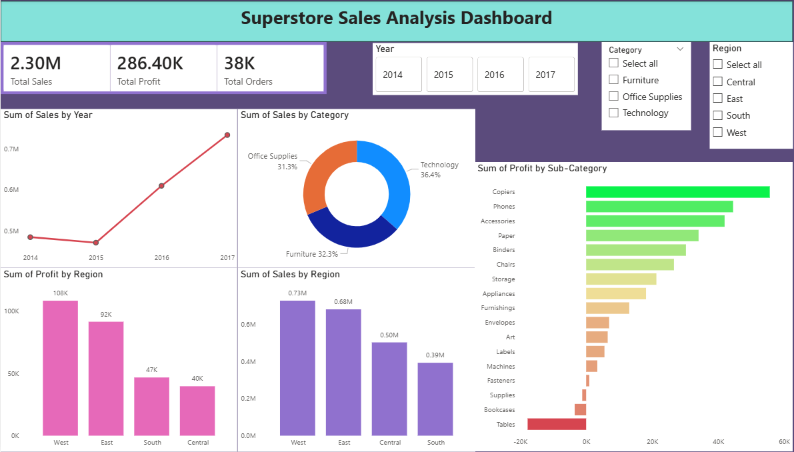

# 📊 Business Sales Performance Analytics

## 📌 Project Overview
This project focuses on analyzing retail sales data from a Superstore dataset to identify business trends, top-performing products, profitable categories, and regional performance.

The objective of this project is to clean raw sales data, perform exploratory data analysis (EDA), generate business insights, and build an interactive Power BI dashboard for decision-making.

---

# 🎯 Objectives
- Clean and preprocess raw sales data
- Analyze sales and profit trends
- Identify top-selling products
- Analyze category and regional performance
- Create interactive visualizations
- Build a professional Power BI dashboard
- Generate business recommendations

---

# 🛠️ Technologies Used

## Programming & Analysis
- Python
- Pandas
- NumPy
- Matplotlib

## Visualization
- Power BI

---

# 📂 Dataset
Dataset Used: Sample Superstore Dataset

Columns Included:
- Order Date
- Sales
- Profit
- Category
- Sub-Category
- Region
- Product Name
- Customer Segment
- Ship Mode

---

# 🧹 Data Cleaning Steps
The following preprocessing steps were performed:

- Removed duplicate records
- Checked missing values
- Converted date columns to datetime format
- Created new columns:
  - Year
  - Month
  - Month Name
- Verified data types

---

# 📊 Exploratory Data Analysis (EDA)

## Analysis Performed
- Revenue trend analysis
- Profit analysis
- Top-selling products
- Category-wise sales analysis
- Region-wise sales analysis
- Profitability analysis

---

# 📈 Dashboard Features

The Power BI dashboard includes:

- KPI Cards
  - Total Sales
  - Total Profit
  - Total Orders

- Interactive Charts
  - Sales Trend Over Time
  - Top Products
  - Category Performance
  - Regional Sales Analysis
  - Profit Analysis

- Filters/Slicers
  - Year
  - Region
  - Category

---

# 🔍 Key Insights

- Technology category generated the highest profit.
- Furniture category showed low profitability despite high sales.
- West region had the highest sales performance.
- Business sales increased significantly after 2015.
- A small number of products contributed major revenue.

---

# 💡 Recommendations

- Focus more on high-margin technology products.
- Reduce discounts on furniture items.
- Improve marketing strategies in low-performing regions.
- Optimize shipping and logistics costs.
- Promote top-selling products aggressively.

---

# 📷 Dashboard Preview

---

# 🚀 How to Run the Project

## Python Analysis
1. Install required libraries:
```bash
pip install pandas numpy matplotlib
